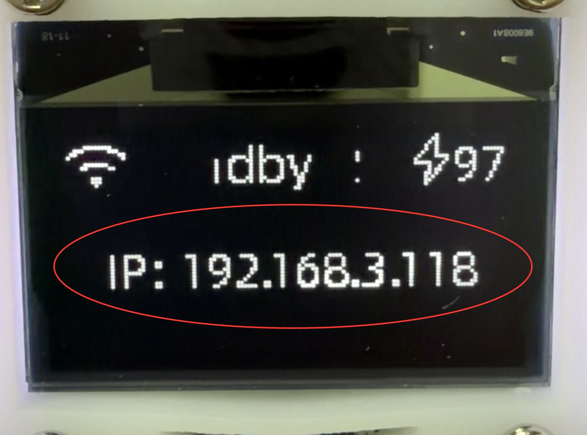
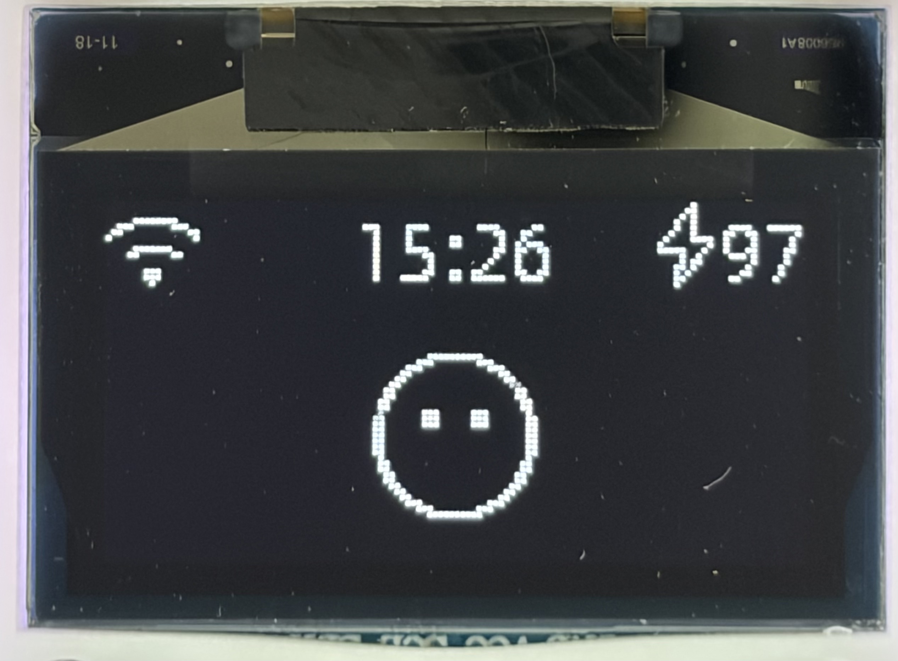
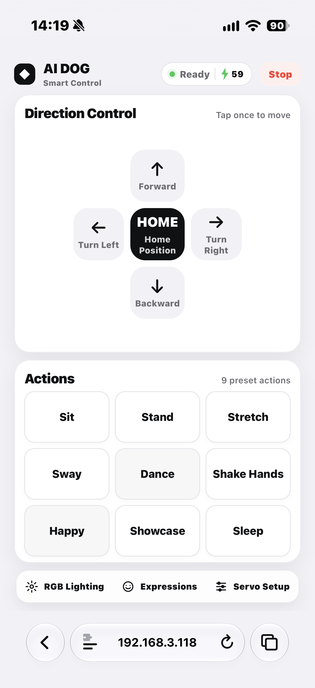

Function Usage Guide
====================

The LAFVIN ESP32 S3 4DOF AI Robot Dog is a four-degree-of-freedom smart robot dog DIY kit powered by an ESP32-S3.
Four SG90 micro servos independently drive the front-left, rear-left, front-right, and rear-right legs for walking,
turning, and expressive motion routines.

The robot dog integrates Wi-Fi, AI voice interaction, an OLED animated expression display, a speaker, programmable
RGB lighting, browser-based controls, and battery-level monitoring. You can interact with it by voice or use a phone
browser to control movement, play actions, test OLED expressions, select RGB effects, and calibrate the servo home positions.

.. important::

   This is an assemble-and-adjust robot kit. Servo manufacturing tolerances, servo-horn mounting positions, and
   3D-printed part tolerances can affect its standing and walking performance. Before first use, check the
   ``Home Position`` and complete servo zero-position calibration.

----

Powering On and Connecting to Wi-Fi
-----------------------------------

1. Connect a single 18650 battery to provide a stable power supply.

2. During startup, the OLED displays initialization and Wi-Fi connection status.

3. For a detailed Xiaozhi configuration tutorial, please click :ref:`here <configure-xiaozhi>`.

4. After the device connects to Wi-Fi, it enters standby mode and briefly displays its IP address below the status bar.

.. raw:: html

   

5. Write down this address, for example ``192.168.3.227``.

6. Connect your phone, tablet, or computer to the **same Wi-Fi network** as the robot dog.

In standby mode, the OLED status bar shows:

.. raw:: html

   

* Wi-Fi status on the left;
* time in the center; and
* estimated battery level on the right.

.. danger::

   The ESP32-S3 supports **2.4 GHz Wi-Fi only**. The robot dog cannot connect to a 5 GHz-only network. It may also be
   unreachable from a phone connected through a client-isolated guest network.

----

Web Control
-----------

After confirming that your phone and the robot dog are on the same local network, enter the IP address shown on the OLED
screen in your browser address bar:

.. image:: _static/function/3.WebControl.png
   :width: 600
   :align: center

.. raw:: html

   

The ``AI DOG Smart Control`` page provides the controls below.

.. raw:: html

   

Movement Controls
^^^^^^^^^^^^^^^^^

* :guilabel:`Forward`: Walk forward.

* :guilabel:`Backward`: Walk backward.

* :guilabel:`Turn Left`: Turn left.

* :guilabel:`Turn Right`: Turn right.

* :guilabel:`Home Position`: Return to the calibrated standing pose.

* :guilabel:`Stop`: Stop the current action and return to a safe pose.

Preset Actions
^^^^^^^^^^^^^^

The web interface includes nine preset actions:

.. list-table::
   :widths: 25 75
   :header-rows: 1

   * - Button
     - Description
   * - ``Sit``
     - Sit down and hold the pose.
   * - ``Stand``
     - Return to the standing pose.
   * - ``Stretch``
     - Perform a synchronized forward-and-backward leg stretch.
   * - ``Sway``
     - Perform a body-swaying action.
   * - ``Dance``
     - Perform a dance routine.
   * - ``Shake Hands``
     - Raise the front-left leg for a handshake.
   * - ``Happy``
     - Perform a happy interaction routine.
   * - ``Showcase``
     - Demonstrate the legs one at a time.
   * - ``Sleep``
     - Move into and hold a sleeping pose.

.. tip::

   ``Sit`` and ``Sleep`` keep the robot dog in their final pose. Before walking again, select :guilabel:`Home Position`
   or :guilabel:`Stand` to prevent the feet from dragging and to improve movement stability.

----

Intelligent AI Voice Dialogue
-----------------------------

.. image:: _static/function/5.Xiaozhi.png
   :width: 600
   :align: center

.. raw:: html

   

This project is perfectly compatible with Xiaozhi AI and supports multiple languages. You can converse with the robot via voice. The robot will process your voice input and respond accordingly based on your configured settings.

- You can ask it any questions:

 - "What is the weather like today?"
 - "What is the current time?"
 - "What is the current humidity?"
 - "Tell a joke"
 - "What is the capital of France?"
 - "How are you doing?"
 - "What is the meaning of life?"
 - "Tell me a story"
 - "What is your favorite color?"
 - "What is the weather like tomorrow?"
…

Once the device is online and its AI voice service has initialized, use the configured wake word to start an interaction.
If the wake word is not recognized, **short-press the BOOT button** to enter listening mode directly, then speak your command.

Example voice commands:

 - Go forward.
 - Go forward five steps.
 - Go backward three steps.
 - Turn left.
 - Turn right.
 - Sit down.
 - Shake hands.
 - Dance.
 - Show a happy expression.
 - Turn on rainbow lights.
…

Forward and backward commands support step counts. For example, saying ``Go forward five steps`` repeats the appropriate
walking sequence five times.

.. note::

   Voice recognition depends on network quality, ambient noise, speaking distance, and microphone installation.
   For best results, speak clearly, use short commands, and stay close to the robot dog.

----

OLED Expression Mode
--------------------

In normal mode, the OLED shows Wi-Fi status, time, battery level, dialogue subtitles, and a small expression.
**Long-press the BOOT button** to enter or exit ``Expression Mode``.

.. note::

   The OLED battery percentage is an estimate. A small difference from the voltage measured by a multimeter is normal.

In Expression Mode, the screen focuses on animated eye expressions and no longer shows dialogue subtitles. Voice audio
output continues normally. Use the :guilabel:`Expressions` page in the web interface to test the available expressions:

* Neutral, Happy, Sad, Angry, and Surprised;
* Thinking, Sleepy, Winking, and Crying.

When Expression Mode is active, some motion routines also display randomly selected expressions that match the action.

----

RGB Lighting
------------

Open :guilabel:`RGB Lighting` from the bottom of the web interface to turn RGB effects on or off and select an effect:

.. list-table::
   :widths: 25 75
   :header-rows: 1

   * - Effect
     - Description
   * - ``Solid``
     - Solid white light.
   * - ``Breathe``
     - Breathing light effect.
   * - ``Rainbow``
     - Rainbow color transition.
   * - ``Flow``
     - Flowing light effect.
   * - ``Flash``
     - White flashing light.
   * - ``Motion Sync``
     - Lighting synchronized with walking and servo movement.

When RGB effects are disabled, the LEDs return to their system-status indication function. In ``Motion Sync`` mode,
the LEDs are solid white while idle, then vary in color and flash rate with the movement direction, servo speed, and action rhythm.

----

Battery and Power Notes
-----------------------

* Use one 3.7 V 18650 lithium-ion cell.
* A fully charged cell is approximately 4.2 V. Low voltage reduces servo torque and Wi-Fi stability.
* If movement becomes weak, servos jitter, the device restarts, or Wi-Fi disconnects, check the battery level first.
* Remove the battery when the product will not be used for an extended period.
* Do not use a damaged, swollen, leaking, or otherwise abnormal battery.

.. warning::

   Servos draw substantial current during movement. Use a sufficiently charged, reliable battery source.
   Insufficient power can cause OLED flickering, Wi-Fi disconnections, voice failures, or unexpected restarts.

----

FAQ For Function Usage Guide
----------------------------

**​How ​​to switch operating modes after powering on?**

- Press and hold the **BOOT** button to switch between Conversation mode and Emoticon mode. Powering on defaults to Conversation mode.

----

**What to do if voice commands are not recognized or are unresponsive?**

- Check if the network or voice service (such as Xiaozhi AI) is available and correctly configured.

- Speak in a quiet environment to avoid excessive background noise.

- If there is still no response, restart the device and check the serial port/log for error information.

----

----

**What to do if the OLED screen does not display or displays abnormally?** 

- Check that the power supply and connection cables are secure.
- Check the battery charge level and polarity.

----

**How ​​to troubleshoot servo motors that are not moving or vibrating?**

- Ensure the power supply provides sufficient current (do not rely solely on USB power when operating multiple servos).

- Check that the servo signal cables and wiring sequence are correct.

- If the position is off or stuck, perform servo limit/zero point calibration and check the mechanical limits.

----

**How ​​to make the robot execute voice commands such as head shaking?**

- Use example phrases directly in conversation mode (e.g., "Shake your head left/right", "Scan left, right, and up").

----

**How ​​to restore factory settings or reset the device?**

- This document does not define a one-button restore procedure. To clear the configuration, you can re-flash the factory firmware.

----

**Which languages ​​are supported?**

- This project is compatible with Xiaozhi AI and supports multiple languages. Specific supported languages ​​depend on the configured voice service and model.

----

**What safety precautions should be taken when using the device?**

- Avoid touching the servos directly with your hands while they are moving.

- Do not use the equipment in high temperature or humid environments. Avoid water ingress and short circuits.

- Do not apply additional loads to the servo motor or force it to move beyond its mechanical limits.

----

**The web control page does not open**

- Confirm that the phone and robot dog are connected to the same 2.4 GHz Wi-Fi network.
- Enter the complete address, for example ``http://192.168.3.227``.
- Restart the robot dog and wait for the OLED to show its IP address again.
- Disable VPN on the phone and avoid guest networks with client isolation enabled.

----

**The wake word or voice interaction does not respond**

- Confirm that the device is online and has completed startup.
- Short-press BOOT to check whether direct listening mode works.
- Speak near the microphone and away from loud noise sources such as fans, televisions, or crowds.
- Check the speaker connection and power supply.

----

**The robot dog shuffles, walks crookedly, or raises a foot**

- Test on a flat, dry surface with moderate friction.
- Check that the battery is sufficiently charged.
- Confirm that the left and right legs are not swapped and that servo connections are correct.
- Recalibrate all four legs as described in :ref:`servo-calibration-en`.
- Check for loose servo-horn, bracket, or leg screws.

----

**The servos jitter continuously or become hot**

- Select :guilabel:`Stop` immediately and disconnect power.
- Check whether a leg is hitting the body, blocked by an object, or at its mechanical limit.
- Check for a low battery.
- Recalibrate the affected leg's Home position to prevent the servo from remaining stalled.

----