2. Assembly Tutorial
====================

**This chapter details the assembly process for the AI ​​robot dog and provides a comprehensive, illustrated tutorial; please read carefully and follow the steps to complete the assembly.**

.. attention::

 - Before starting the assembly, please make sure to read the instructions carefully and follow the steps in order. If you encounter any issues during the assembly process, feel free to reach out to our support team for assistance. We are here to help you every step of the way!    
            
 - Before assembly, be sure to flash the program onto the main control board to ensure that the subsequent servo calibration can be performed correctly. If you have not yet completed the flashing process, please click here for detailed instructions on how to flash the firmware to the main control board. :ref:`Flash The Firmware`

----

Before You Begin
----------------

#. Prepare a level surface with moderate friction. For the first walking test, avoid glass, polished tile, and deep-pile carpet.
#. Confirm that the four servos, 3D-printed legs, servo brackets, and screws are present.
#. Use the included USB Type-C cable to connect the robot dog to a computer for firmware flashing, or debugging.
#. Prepare one healthy 3.7 V 18650 lithium-ion cell and verify the battery polarity against the markings on the control board.
#. During the first assembly, do not fully tighten the servo-horn and leg screws until the initial standing pose has been checked.

----

Each servo controls one leg. The left and right legs are mirror-image parts and **must not be swapped**.
Follow the assembly diagram and labels on the control board when connecting the servos.

.. list-table:: Servo Signal Mapping
   :widths: 35 25 40
   :header-rows: 1

   * - Leg Position
     - Signal Pin
     - Abbreviation
   * - Front Left
     - GPIO17
     - LF
   * - Rear Left
     - GPIO18
     - LR
   * - Front Right
     - GPIO13
     - RF
   * - Rear Right
     - GPIO14
     - RR

Recommended assembly order:

#. Fit each SG90 servo into a servo bracket.
#. Secure the brackets to the body structure.
#. Install the 3D-printed legs in their correct left/right mirror orientation.
#. Power on the robot dog and run :guilabel:`Home Position` once.
#. Check that all four feet rest on the surface and that the body is reasonably level.
#. If a leg is raised, leaning too far forward, or leaning too far backward, complete :ref:`servo-calibration-en` first.

.. warning::

   Never force a leg by hand while the servo is powered. If a leg contacts the body, binds mechanically, or a servo
   continues to jitter, stop the action immediately and disconnect power before inspecting the assembly.

----

Step 1: Assemble The Servo
---------------------------

**Required components:**

- SG90 Servo Motors (4 PCS)

- Metal Servo Bracket (4 PCS)

- M2x8mm Screw (8 PCS)

- M2 Nut (8 PCS)

**Assembly Steps:**

- Attach the SG90 servo motors to the metal servo bracket using the M2x8mm screws. Ensure that the servo motors are securely fastened and aligned properly.

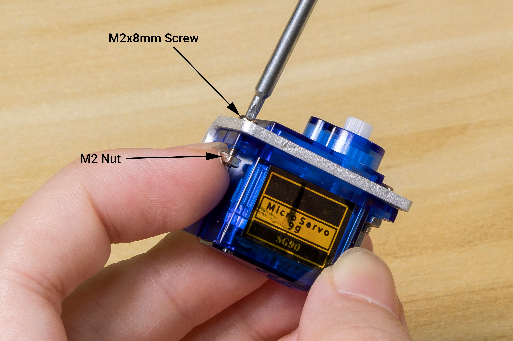

.. raw:: html

   

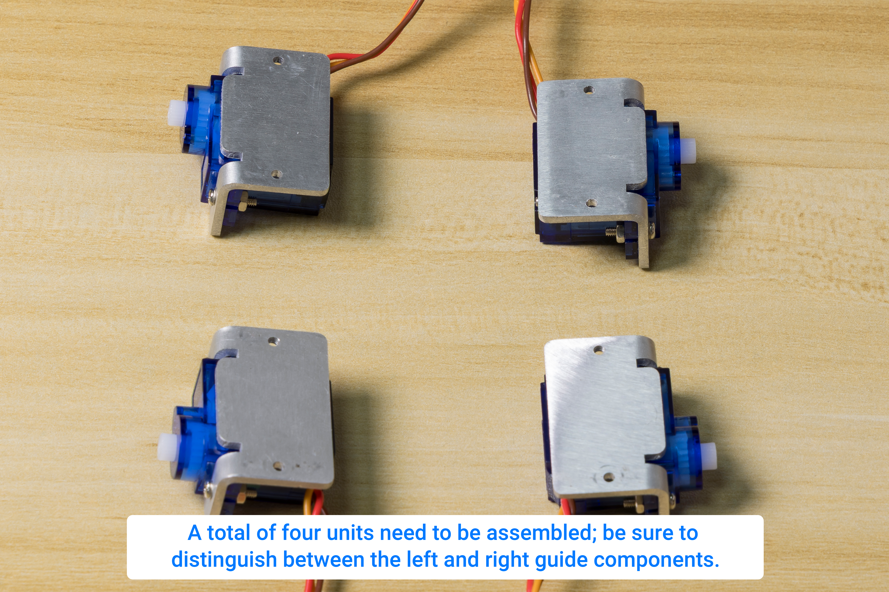

.. raw:: html

   

.. attention::

  The servo motors are installed in two different directions: one group for the front legs and one group for the rear legs.

----

Step 2: Assemble The Servo Into The Body
-----------------------------------------

**Required components:**

- Assembled Servo Motor (4 PCS)

- Main Control Board

- M2x8mm Screw (8 PCS)

**Assembly Steps:**

- Secure the servo motors to the main control board using the M2x8mm screws. Ensure that all screws are tightened properly to prevent any movement during operation.

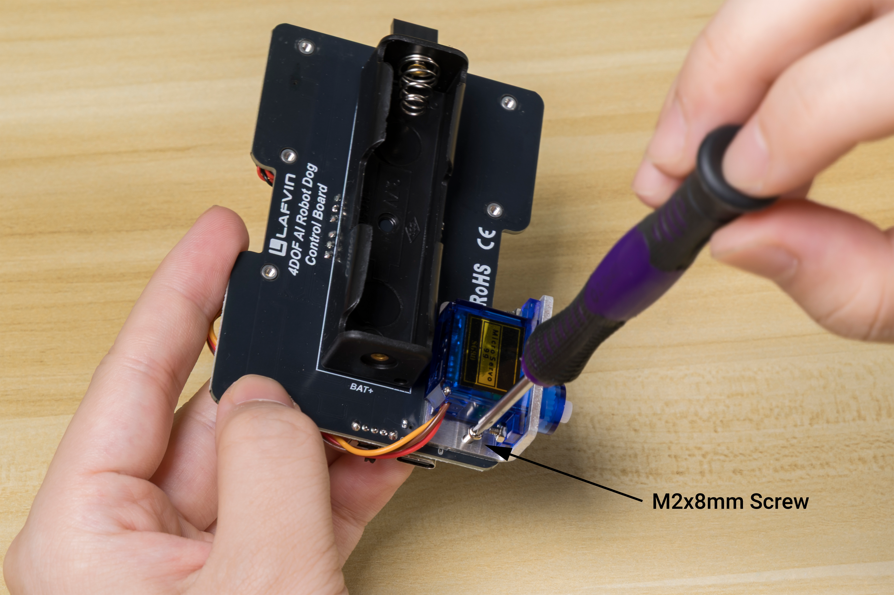

.. raw:: html

   

- Insert the assembled servo motors into the designated slots on the main control board. Make sure that the servo motors are oriented correctly and that the wires are not pinched or obstructed.

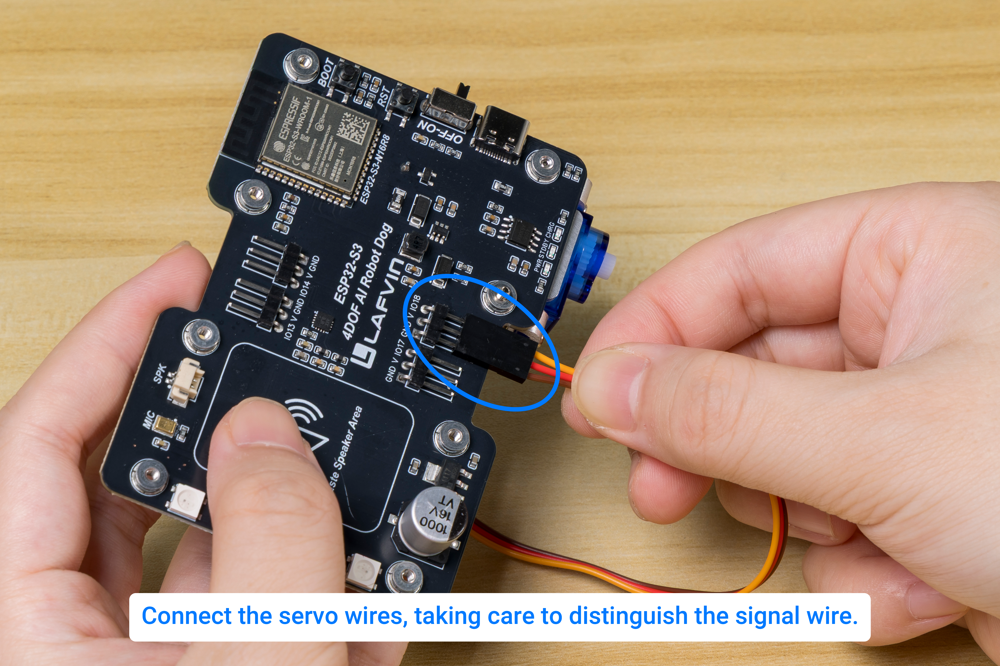

.. raw:: html

   

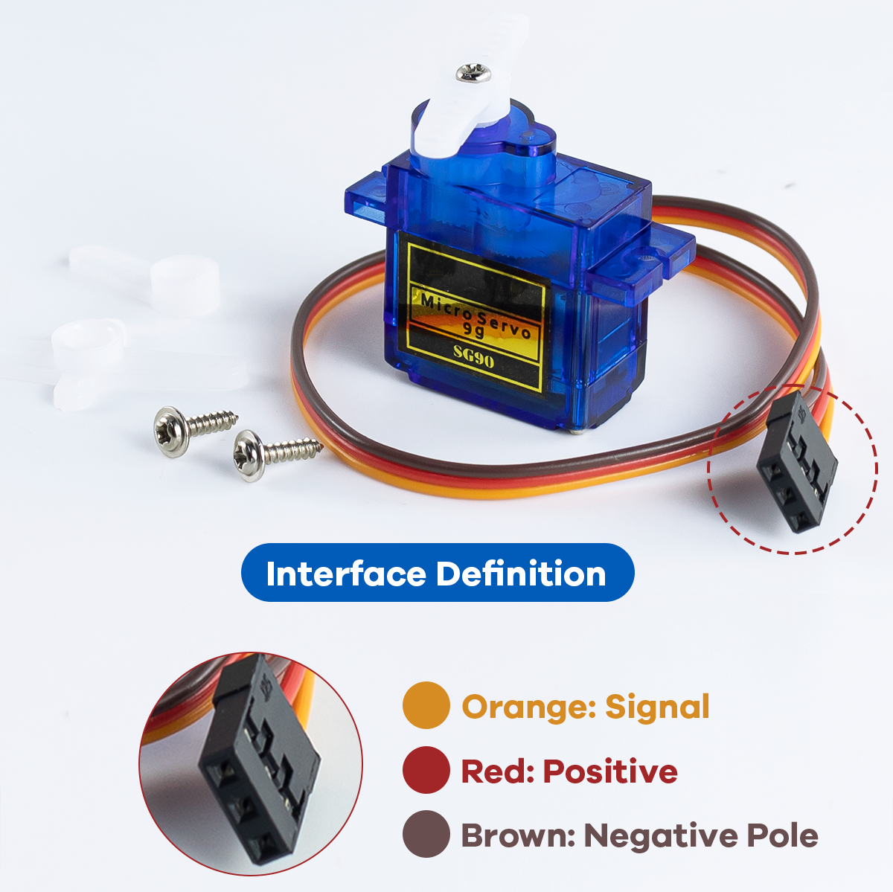

.. raw:: html

   

.. attention::

 The SG90 servo has three wires; please identify the colors before connecting them to the corresponding terminals:

 Brown wire → Ground (GND)

 Red wire → Positive power supply (VCC)

 Yellow/Orange wire → PWM signal input

.. image:: _static/assembly/10.png
   :width: 800
   :align: center

.. raw:: html

   

----

Step 3: Assemble The Swing Arm To The Leg
-----------------------------------------

**Required components:**

- Servo Arm (4 PCS included in the servo package)

- Leg 3D Printed Parts (4 PCS)

- M1.5x5mm Self-Tapping Screw (4 PCS)

**Assembly Steps:**

- Use M1.5x5mm self-tapping screws to attach the 3D-printed leg parts to the servo arm.

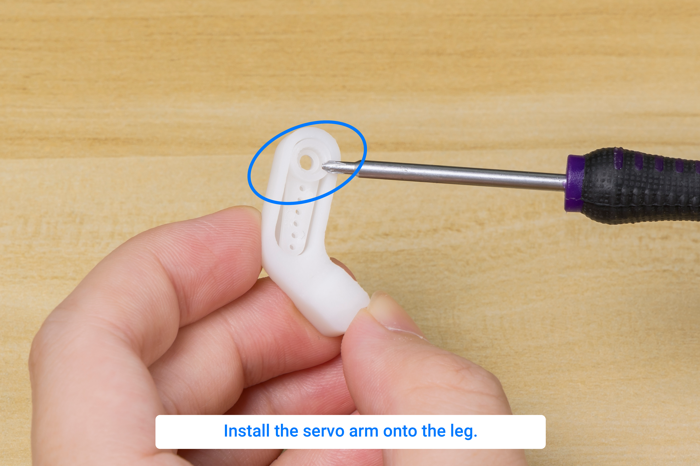

.. raw:: html

   

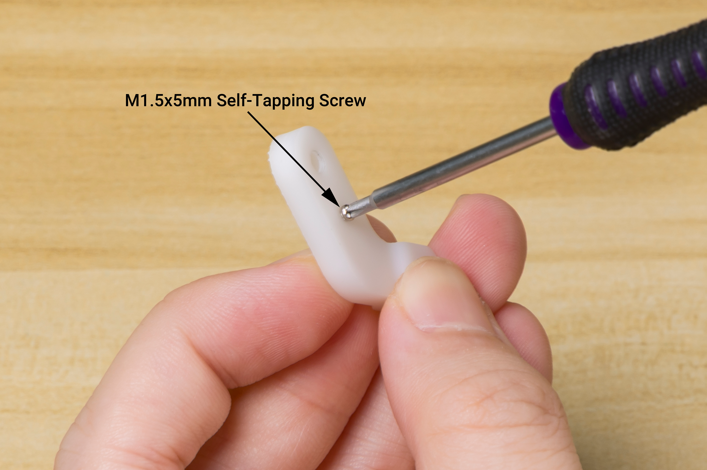

.. raw:: html

   

.. image:: _static/assembly/9.png
   :width: 800
   :align: center

.. raw:: html

   

----

Step 4: Assemble The Leg To The Servo
-------------------------------------

**Required components:**

- Assembled Leg (4 PCS)

- M2x4mm Screw (4 PCS included in the servo package)

**Assembly Steps:**

- Make sure the firmware has been flashed onto the main control board, install a battery, turn on the switch, and you should see the servo motor rotate back to its initial position.

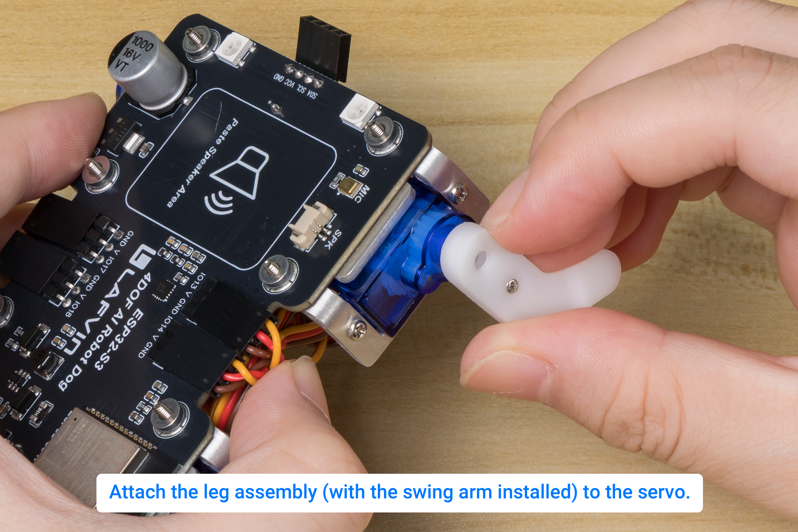

.. raw:: html

   

- Please refer to the following video for the specific procedure for servo calibration.

.. video:: _static/assembly/19.servo.mp4
    :width: 100%

- Use M2x4mm screws to attach the assembled leg to the servo motor. Ensure that the leg is securely fastened and can move freely without obstruction.

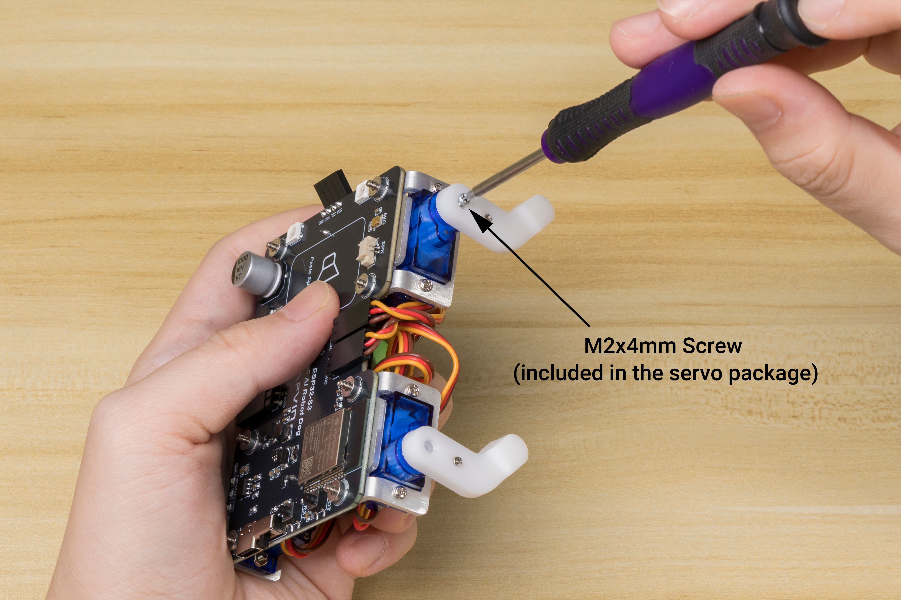

.. raw:: html

   

.. attention::

 - Please calibrate the servo before tightening the M2x4mm screws.

 - The legs are initially installed at a 90-degree angle to the horizontal plane.

 - If the servo motor does not return to its initial position, please check if the firmware has been flashed correctly. If the issue persists, please contact our support team for assistance.

----

Step 5: Assemble The Speaker
----------------------------

**Required components:**

- Speaker (1 PCS)

- Round Double-Sided Tape (1 PCS)

**Assembly Steps:**

- Use round double-sided tape to fix the speaker to the designated position on the main control board and insert the speaker interface into the hole.

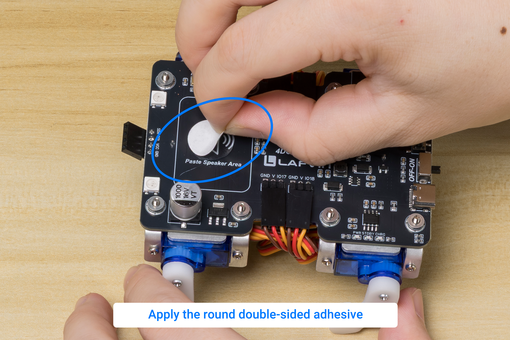

.. raw:: html

   

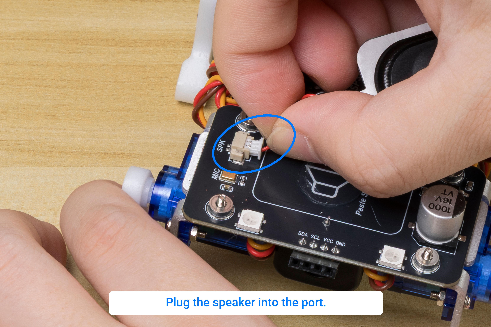

.. raw:: html

   

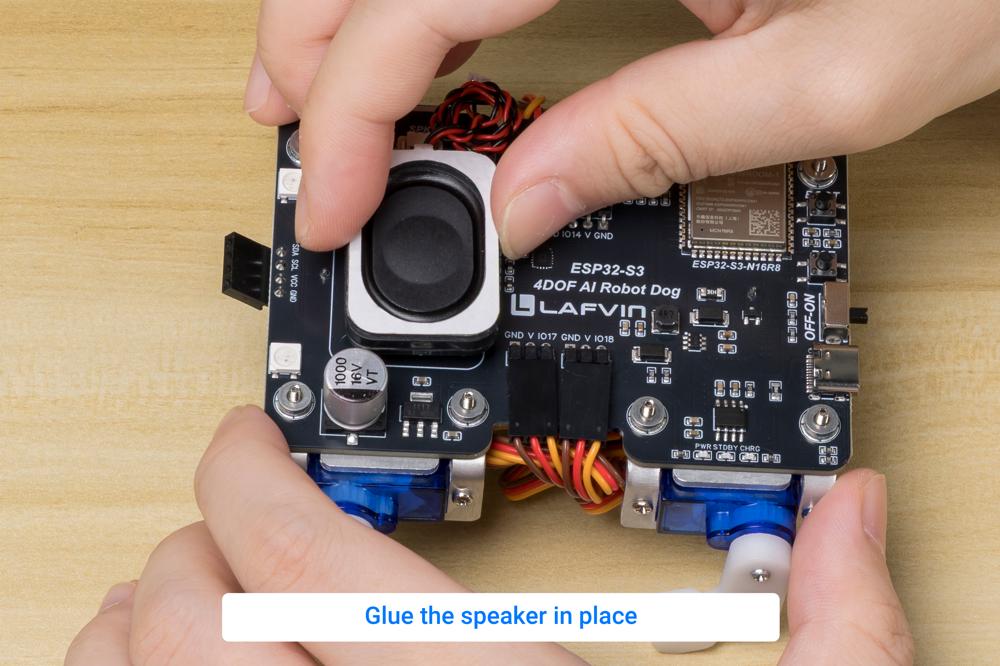

.. raw:: html

   

----

Step 6: Assemble The Screen
---------------------------

**Required components:**

- 0.96" OLED Screen (1 PCS)
- 3D Printed Head Parts (1 PCS)
- M2x8mm Screw (4 PCS)
- M2 Nuts (4 PCS)

**Assembly Steps:**

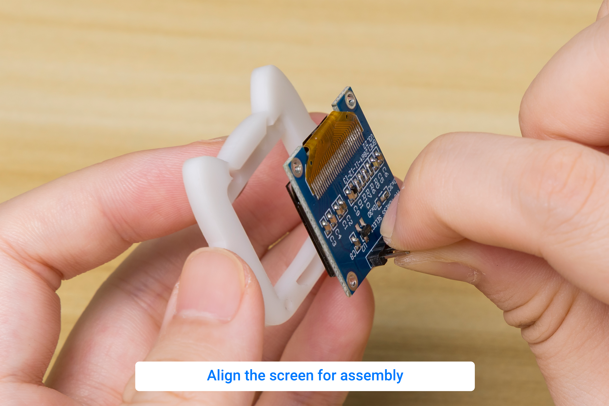

.. raw:: html

   

- Use M2x8mm screws and M2 nuts to attach the 0.96" OLED screen to the 3D-printed head parts. Ensure that the screen is securely fastened and properly aligned.

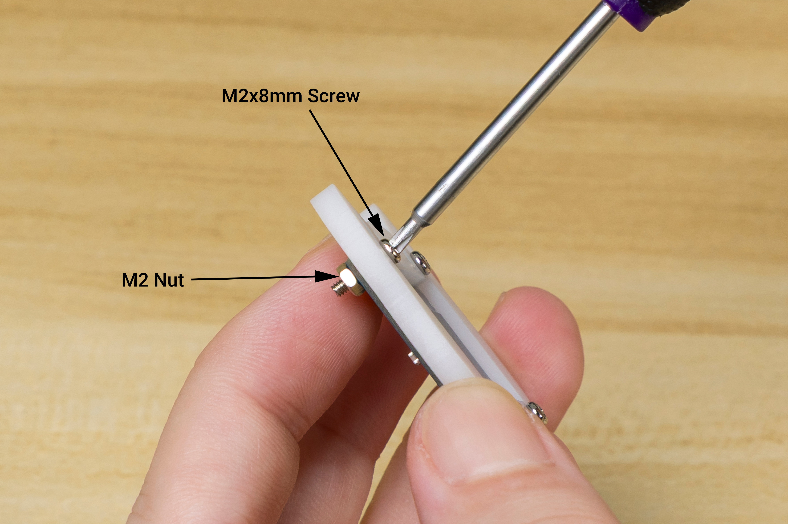

.. raw:: html

   

- Insert the assembled screen into the designated slot on the main control board. Make sure that the screen is oriented correctly.

.. image:: _static/assembly/18.png
   :width: 800
   :align: center

.. raw:: html

   

----

Step 7: Organize The Wire Harness
---------------------------------

**Required components:**

- Cable Tie (4 PCS)

**Assembly Steps:**

- To ensure the robotic dog's movements remain unrestricted while walking, cable ties can be used to organize the servo wiring harnesses.

.. image:: _static/assembly/2.png
   :width: 800
   :align: center

.. raw:: html

   

----

.. _servo-calibration-en:

Servo Zero-Position Calibration
-------------------------------

- Servo calibration requires configuration via the web interface. Click here to view instructions on how to access the web interface. :ref:`Web Control` 

- The specific steps for calibrating the servos are outlined below.

Servo tolerances, servo-horn spline positions, and 3D-printed part tolerances can cause assembly offsets. Use the
:guilabel:`Servo Setup` page to calibrate the Home position of each leg.

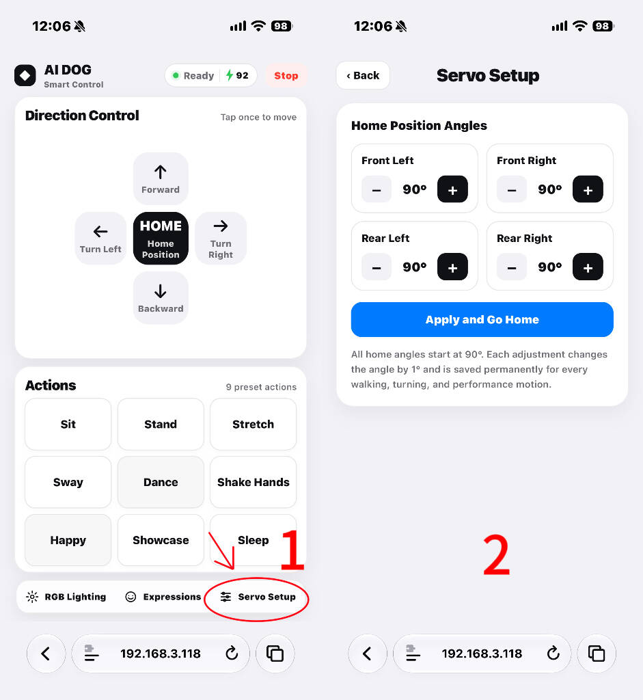

.. raw:: html

   

#. Select :guilabel:`Home Position` to move the robot dog to its initial standing pose.
#. Check whether all four feet contact the surface and whether the body leans noticeably to one side.
#. Choose the leg to adjust in :guilabel:`Servo Setup`.
#. Use ``−`` or ``+`` to adjust the value in **1° increments**.
#. Select :guilabel:`Apply and Go Home` to check the result.
#. Repeat as needed until all four feet make stable contact and the body is approximately level.

The calibrated zero positions are stored in the device and are applied automatically to the Home pose, walking, turning,
and preset action routines.

.. danger::

   Adjust by only 1--2° at a time and observe the result before making further changes. Large adjustments may cause a leg
   to hit the body, lift a foot off the surface, or stall a servo at its mechanical limit.

----
